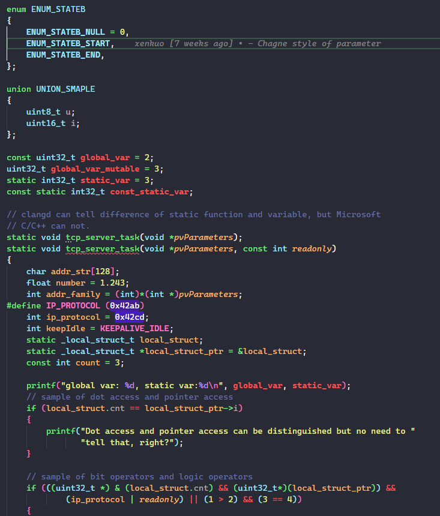

# README

---

**A theme dedicated for C/C++ programer.**

---

**C/C++ Theme** utilizes the power of VSCode semantic highlighting engine to provide a fluent, systematic C/C++ syntax highlighting experience.

> The dark theme bases on [Dracula Official](https://marketplace.visualstudio.com/items?itemName=dracula-theme.theme-dracula), the light theme bases on [Bluloco Light](https://marketplace.visualstudio.com/items?itemName=uloco.theme-bluloco-light), so supposedly it should work with other language as well.

**C/C++ Theme** recognizes more C/C++ syntax symbols and renders them in a opinionated way. :) Below are some samples.

> C/C++ Theme with MS C/C++ extension

> C/C++ Theme with clangd extension

**C/C++ Theme** supports both MS C/C++ and clangd LSP, and provides a consistent(similar but not exactly same) rendering result. If you want to learn the token set that **C/C++ Theme** supports, please refer to below image:

Beside of recognizing of so many tokens, **C/C++ Theme** tries to have kind of design logic. It has these built-in principles to achieve the goal:

1. Priority Design
   1. Scope has highest priority
   2. Then type
   3. Then readonly, or declaration, or other attributions
2. Consistency Design
   1. Consistency between similar concepts, e.g., static variable shares similar UI with global variable
   2. Consistency between C and C++
   3. Consistency between MS C/C++ and clangd. **C/C++ Theme** leverages the two LSP to get semantic tokens, they generates different semantic token set and names, **C/C++ Theme** aggregate them into a uniform rendering.
   4. Consistency with the based theme [Dracula Official](https://github.com/dracula/visual-studio-code.git). All the colors **C/C++ Theme** used are from the based theme.
3. Style Design
   1. `underline` is a very strong style, it was limited for kind of special tokens. e.g. static variable or static functions.

## Q&A

1. Why this name?
    > Similar with the Microsoft's **C/C++ Themes**? :) Just that theme are not so C/C++, I made this one. I believe this theme is more C/C++ than it, Just give my theme a chance, you'll love it.
    
2. Support of C++.
    > I don't use much of C++, so there's only basic support to C++(maybe already enough). If you have better idea to render C++ tokens, welcome to contribute(PR or issue).

3. Differentiation between MS C++ extension and clangd extension.
    > Both are the top end C/C++ LSPs, clangd offers more precise token types than MS C++, especially to `variable` and `function` types, and it's fast. MS C/C++ offers a more appropriate token set and better compatibility(only my personal experience based on daily usage).

## Development

To contribute or modify the theme, please refer to [Here](./Develop.md).
 